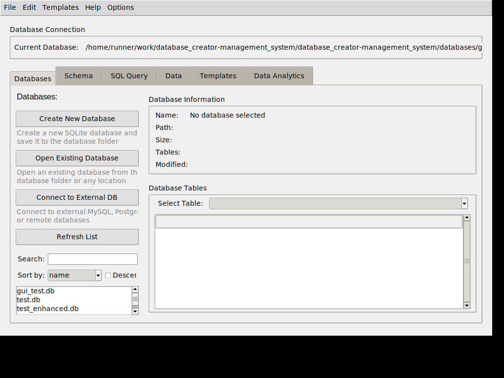

# 🗃️ Database Creator & Management System

<div align="center">


</div>

A powerful, flexible SQLite database management tool featuring both intuitive GUI and efficient CLI interfaces. Perfect for developers, data analysts, and anyone needing to quickly create and manage structured data.

## 📁 Project Structure

```
database-creator/
├── database_creator/     # Core module containing all main functionality
│   ├── __init__.py
│   ├── database.py       # Core database handling
│   ├── gui.py            # GUI implementation
│   ├── cli.py            # CLI implementation
│   ├── theme_manager.py  # GUI theme handling
│   └── ... other modules
├── dev_tests/            # Testing files
├── docs/                 # Documentation
├── databases/            # Default database storage location
├── sample_databases/     # Example databases
├── utils/                # Utility scripts
│   ├── fixers/           # Linting and syntax fixing tools
│   └── debug/            # Debugging tools
├── main.py               # Main entry point
└── requirements.txt      # Project dependencies
```

## ✨ Features

- **Dual Interfaces** - Choose between a full graphical interface or efficient command line
- **Excel-like Editor** - Create and edit tables with a familiar spreadsheet interface
- **Centralized Storage** - Dedicated database storage folder for better organization
- **Advanced Database Management** - Search, sort, clone, and manage all your databases
- **CRUD Operations** - Create, read, update, and delete data with an intuitive interface
- **Data Search & Filter** - Find and filter database content easily
- **SQL Analytics** - Run custom SQL queries with a syntax-highlighted editor
- **Data Visualization** - Create charts and visualizations from your query results
- **External Databases** - Connect to MySQL, PostgreSQL, and other database systems
- **Statistical Analysis** - View detailed statistics and summaries of your data
- **Template System** - Jump-start projects with predefined database schemas
- **Advanced E-Commerce** - Complete schema for professional e-commerce applications
- **Import/Export** - Transfer data via SQL, JSON, CSV, TSV, or Excel formats with advanced import wizard
- **Advanced Import System** - Intelligent 4-step wizard for importing text files with automatic data type detection
- **Secure Authentication** - Built-in password hashing for user data
- **Customizable** - Fully extensible design for adding new templates and features

## 🚀 Installation

1. **Clone the repository**:

   ```bash
   git clone https://github.com/yourusername/database-creator.git
   cd database-creator
   ```

2. **Install dependencies**:

   ```bash
   # Dependencies are automatically installed when you run the application
   # You can also install them manually:
   pip install -r requirements.txt
   ```

3. **Run the application**:

   ```bash
   # GUI Mode
   python main.py --gui
   
   # CLI Mode
   python main.py --cli
   
   # Run system diagnostics
   python main.py --diagnostic
   
   # Check health of a specific database
   python main.py --check-db path/to/database.db
   ```

## 📖 Usage

### � Data Analytics

The Data Analytics tab provides powerful tools for analyzing and visualizing your data:


- **SQL Query Editor** - Write and execute complex SQL queries with syntax highlighting
- **Multiple Result Views** - View results as a data grid, raw data, or statistical summary
- **Visualization Options** - Create bar charts, line charts, pie charts, and more
- **External Database Support** - Connect to MySQL, PostgreSQL, SQL Server, and Oracle databases
- **Export Visualizations** - Save charts as PNG, PDF, SVG, or JPEG files

To use the analytics features:
1. Select a database from the dropdown
2. Write your SQL query in the editor or use one of the sample queries
3. Click "Run Query" to execute and view results
4. Choose columns for X and Y axes and select a chart type
5. Click "Generate Visualization" to create your chart

### 💻 GUI Mode

The graphical interface provides an intuitive way to manage your databases:



- **Connect** - Open existing databases or create new ones
- **Create** - Design tables with custom fields and constraints
- **Excel-like Interface** - Create and edit tables with a familiar spreadsheet interface:
  - Right-click on tables to access the Excel-like editor
  - Add/remove rows and columns with intuitive controls
  - View real-time SQL preview of your table structure

- **Advanced Import System** - Import data from various file formats:
  - **4-Step Import Wizard** for CSV, TSV, and text files with intelligent data detection
  - **Excel File Import** with sheet selection and automatic column mapping
  - **Smart Delimiter Detection** automatically identifies file formats
  - **Data Type Inference** automatically detects column types (INTEGER, REAL, TEXT, etc.)
  - **Column Constraints** set Primary Keys, NOT NULL, and UNIQUE constraints during import
  - **Progress Tracking** with batch importing for large files
  - **Error Handling** with options to skip malformed rows

- **Query** - Execute SQL commands with a built-in editor
- **Templates** - Apply pre-built database structures in one click
- **Export** - Save data in multiple formats (SQL, CSV, JSON)

### ⌨️ CLI Mode

Powerful command-line operations for scripting and automation:

```bash
# Create a new database
python main.py --db new_database.db

# Apply a template
python main.py --db new_database.db apply-template simple_blog

# Create a table
python main.py --db new_database.db create posts --columns "id INTEGER PRIMARY KEY" "title TEXT NOT NULL" "content TEXT" "published BOOLEAN DEFAULT 0"

# Run a query
python main.py --db new_database.db query "SELECT * FROM posts"
```

## 📋 Database Templates

Our extensive template collection helps you get started quickly:

| Template | Description | Tables |
|----------|-------------|--------|
| **Simple Blog** | Basic blog structure | Posts, Comments, Categories, Users |
| **Contact Manager** | Personal or business contacts | Contacts, Groups, Interactions |
| **Task Tracker** | Project management | Tasks, Projects, Users, Statuses |
| **Media Library** | Digital content catalog | Media, Artists, Genres, Collections |
| **Web Store** | E-commerce foundation | Products, Orders, Customers, Inventory |
| **Advanced E-Commerce** | Professional online store | 15+ integrated tables with full relationships |
| **Project Management** | Team collaboration | Projects, Tasks, Resources, Timelines |

## 🏗️ Project Structure

```text
database_creator/
├── __init__.py        # Package initialization
├── cli.py             # Command line interface
├── config.py          # Configuration management
├── database.py        # Core database operations
├── gui.py             # Graphical user interface
├── security.py        # Password hashing and validation
├── templates.py       # Template management
├── advanced_templates.py  # Advanced database templates
├── analytics.py       # Data analysis and visualization
├── db_connections.py  # External database connections
├── db_management.py   # Database management interface
├── db_table_manager.py # Table operations
├── db_import_export.py # Import/export functionality
├── db_utils.py        # Utility functions
├── excel_gui.py       # Excel-like interface
└── diagnostics.py     # System diagnostics and troubleshooting
main.py                # Application entry point with automatic dependency management
```

## � Screenshots


## �📚 Documentation

For detailed documentation on using the Database Creator:

- [User Guide](docs/user-guide.md) - Comprehensive usage instructions
- [Template Guide](docs/templates.md) - Creating custom templates
- [API Reference](docs/api.md) - Programmatic usage of the library
- [Contributing](docs/contributing.md) - Guidelines for contributors

## 🧰 Requirements

- **Python 3.6+**
- **SQLite3** (included in Python standard library)
- **Tkinter** (for GUI mode, included with most Python installations)

## 🤝 Contributing

Contributions are welcome! Please feel free to submit a Pull Request.

1. Fork the repository
2. Create your feature branch (`git checkout -b feature/amazing-feature`)
3. Commit your changes (`git commit -m 'Add some amazing feature'`)
4. Push to the branch (`git push origin feature/amazing-feature`)
5. Open a Pull Request

## 📜 License

This project is licensed under the MIT License - see the LICENSE file for details.

## 📬 Contact

Project Link: [https://github.com/yourusername/database-creator](https://github.com/yourusername/database-creator)

---

<div align="center">
Made with ❤️ by Database Creator Team
</div>
